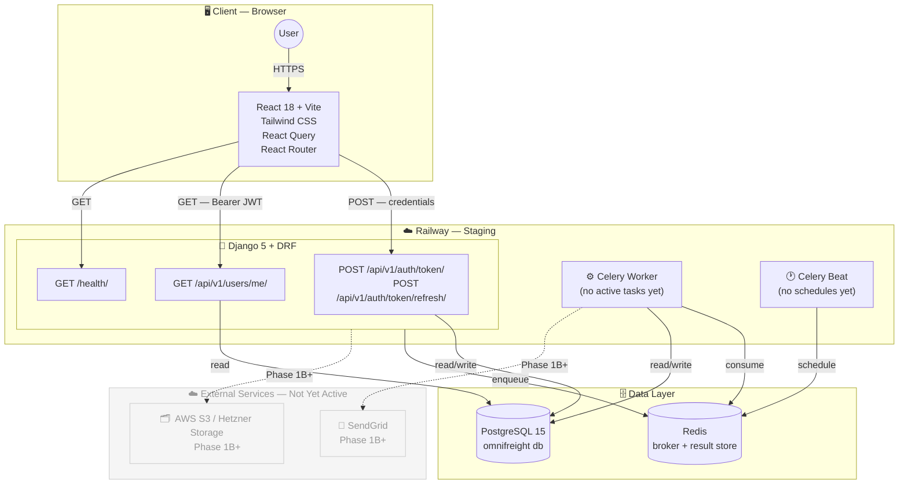
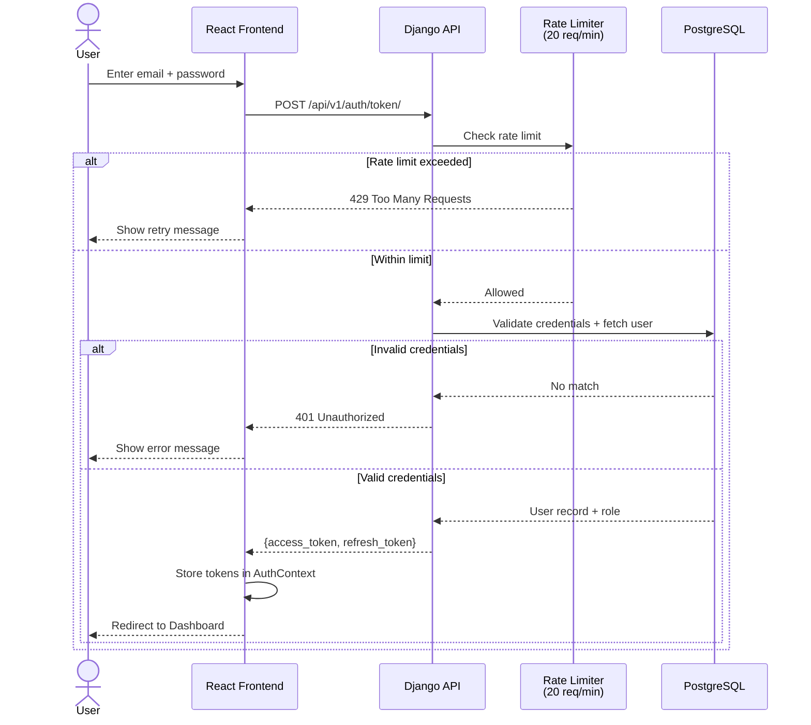
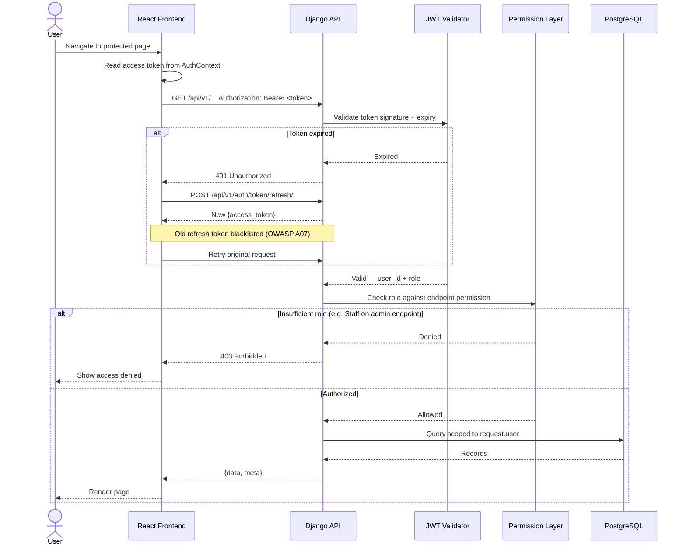
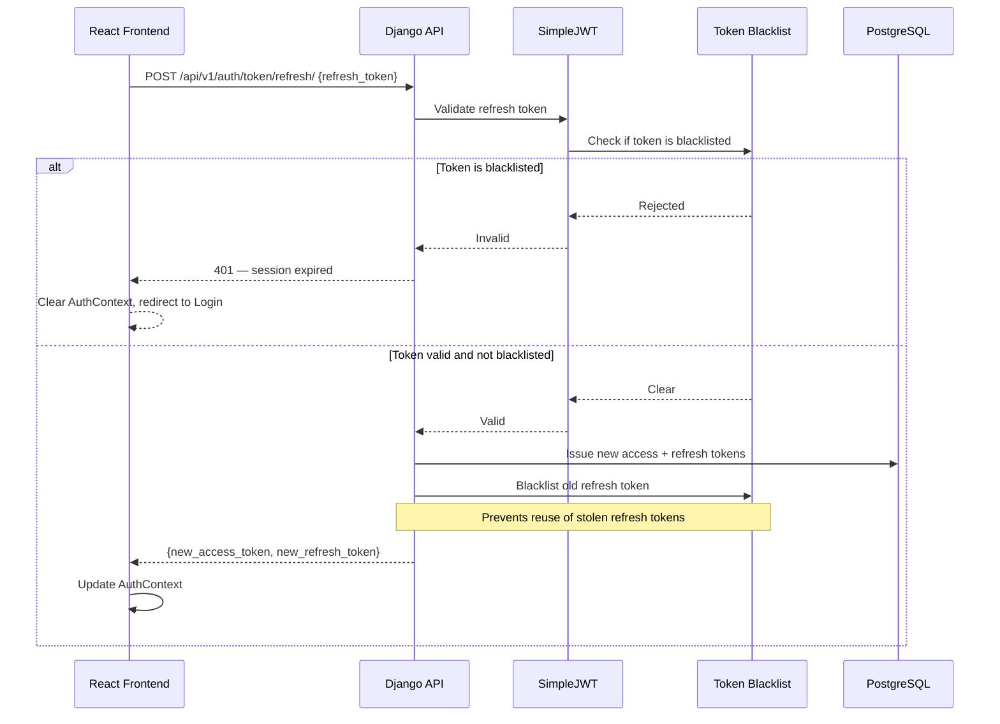
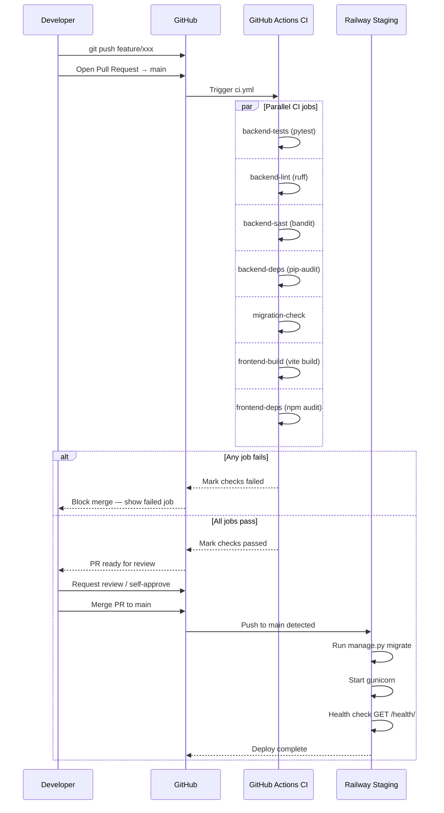
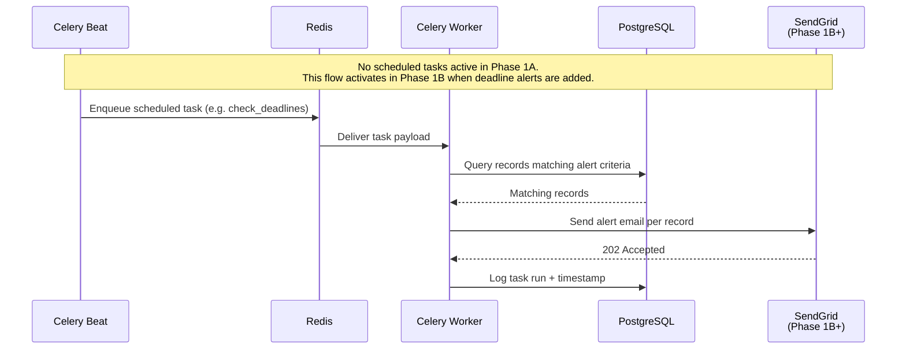

# omniFreight — System Interaction Swimlane

**Personal reference document.** Not included in deployment or production builds.
Updated at each Phase milestone. Copy freely to Notion, Obsidian, or any personal records.

---

## Version History

| Version | Date | Phase | What Changed |
|---|---|---|---|
| 1.0 | 2026-04-27 | 1A — Foundation (base) | Initial scaffold — auth, users app, Docker Compose, CI/CD pipeline |

---

## How to Read This Document

Each version contains two diagram types:

- **Component Map** — what exists and how components connect (architecture view)
- **Interaction Flows** — step-by-step message flows between components (swimlane view)

Mermaid diagrams render in GitHub, Notion, Obsidian, VS Code (with extension), and most modern markdown tools.

---

---

# v1.0 — Phase 1A: Foundation (Base Version)

> **What exists:** Project scaffold. Docker Compose stack running locally.
> Backend: `users` app with JWT auth, custom User model, role-based permissions.
> Frontend: Login page, AuthContext, placeholder Dashboard, protected routes.
> CI/CD: GitHub Actions pipeline, Railway staging, branch protection on `main`.

---

## Component Map



---

## Interaction Flow 1 — Login and Token Issuance



---

## Interaction Flow 2 — Authenticated API Request



---

## Interaction Flow 3 — Token Refresh and Blacklist



---

## Interaction Flow 4 — CI/CD Pipeline (every PR)



---

## Interaction Flow 5 — Background Task (Celery — No Active Tasks in Phase 1A)



---

---

# Upcoming Versions (added when each milestone ships)

```
v1.1 — Phase 1A Complete
  + Vendor management endpoints
  + Inventory catalog endpoints
  + All /api/v1/vendors/ and /api/v1/inventory/ flows added

v1.2 — Phase 1B: Shipment Tracker
  + Shipment lifecycle flows (Ordered → Delivered status pipeline)
  + Document upload flow (S3 presigned URL pattern)
  + Deadline alert flow (Celery Beat → SendGrid activated)
  + Component map updated: SendGrid + S3 go live

v1.3 — Phase 1C: Payments & Machines
  + Payment tracker flow (status transitions + audit log)
  + Payment alert flow (7-day / 3-day / due-date reminders)
  + Machine asset + critical spares flows

v1.4 — Phase 1D: SOP & Dashboards
  + SOP contextual link flow (low stock alert → reorder SOP)
  + Dashboard widget data aggregation flow
  + Predictive reorder calculation flow (Celery task)

v2.0 — Production Migration (Hetzner VPS)
  + Railway replaced by Hetzner VPS in component map
  + Nginx added as reverse proxy layer
  + AWS S3 optionally replaced by Hetzner Object Storage
  + CI/CD deploy-prod.yml workflow added
```
